# MVP — Pipeline de Dados na Nuvem: Churn de Clientes de Telecom

**Aluna:** Beatriz Gonçalves · **MBA em Ciência de Dados e Analytics — PUC-Rio** · Sprint: Engenharia de Dados
**Plataforma:** Databricks Free Edition · **Linguagem:** SQL (Spark SQL) · **Arquitetura:** Medalhão (Bronze → Silver → Gold)

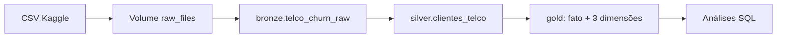
```mermaid
flowchart LR
    A[CSV Kaggle] --> B[Volume raw_files]
    B --> C[bronze.telco_churn_raw]
    C --> D[silver.clientes_telco]
    D --> E[gold: fato + 3 dimensões]
    E --> F[Análises SQL]
```

---

## 1. Contexto de Negócio e Perguntas (Etapa 2 e 4.1)

### 1.1 Problema

Uma operadora de telecomunicações perde parte da sua base de clientes todos os meses (*churn*). Como adquirir um novo cliente custa mais caro do que reter um existente, a empresa precisa entender **quem cancela, em que momento do relacionamento e quanto isso custa em receita**, para direcionar ações de retenção.

O objetivo deste MVP é construir um pipeline de dados na nuvem que transforme a base bruta de clientes em um modelo analítico confiável, capaz de responder às perguntas abaixo.

### 1.2 Perguntas de negócio

1. **P1.** Qual a taxa de churn geral e como ela varia por tipo de contrato?
2. **P2.** Clientes nos primeiros meses de relacionamento cancelam mais?
3. **P3.** O método de pagamento está associado ao churn?
4. **P4.** Clientes que contratam suporte técnico e segurança online cancelam menos?
5. **P5.** Quanto de receita mensal é perdida com o churn e em qual segmento ela se concentra?

### 1.3 Dados brutos

- **Fonte:** Kaggle — *Telco Customer Churn* ([https://www.kaggle.com/datasets/blastchar/telco-customer-churn](https://www.kaggle.com/datasets/blastchar/telco-customer-churn)). Os dados são uma base de exemplo disponibilizada pela IBM (IBM Sample Data Sets).
- **Licença:** *Data files © Original Authors* (conforme a página do dataset no Kaggle). Os direitos pertencem aos autores originais. A base é usada aqui exclusivamente para fins acadêmicos, com citação da fonte. Por esse motivo, o arquivo CSV não foi redistribuído neste repositório.
- **Estrutura:** 1 arquivo CSV, 7.043 linhas (1 por cliente) e 21 colunas:

| Grupo | Colunas |
|---|---|
| Identificação | `customerID` |
| Perfil | `gender`, `SeniorCitizen`, `Partner`, `Dependents` |
| Relacionamento | `tenure` (meses como cliente) |
| Serviços | `PhoneService`, `MultipleLines`, `InternetService`, `OnlineSecurity`, `OnlineBackup`, `DeviceProtection`, `TechSupport`, `StreamingTV`, `StreamingMovies` |
| Contrato | `Contract`, `PaperlessBilling`, `PaymentMethod` |
| Financeiro | `MonthlyCharges`, `TotalCharges` |
| Alvo | `Churn` |

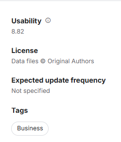

---

## 2. Carga dos Dados (Etapa 4.2)

1. O CSV foi baixado do Kaggle e renomeado. Por causa da extensão oculta no Windows, o arquivo ficou com o nome `telco_churn.csv.csv`, que é o caminho referenciado no script de carga.
2. No Databricks, foram criados os schemas `bronze`, `silver` e `gold` no catálogo `workspace`, além do volume `workspace.bronze.raw_files`.
3. O arquivo foi enviado ao volume pela interface (**Catalog → workspace → bronze → Volumes → raw_files → Upload to this volume**).
4. A tabela `workspace.bronze.telco_churn_raw` foi criada com `read_files()`, preservando os dados exatamente como vieram e adicionando as colunas `_data_ingestao` e `_fonte` para rastreabilidade.
5. A carga foi validada com `COUNT(*)`: **7.043 linhas**, igual ao arquivo original.

**Script:** [`notebooks/01_bronze_ingestao.sql`](notebooks/01_bronze_ingestao.sql)

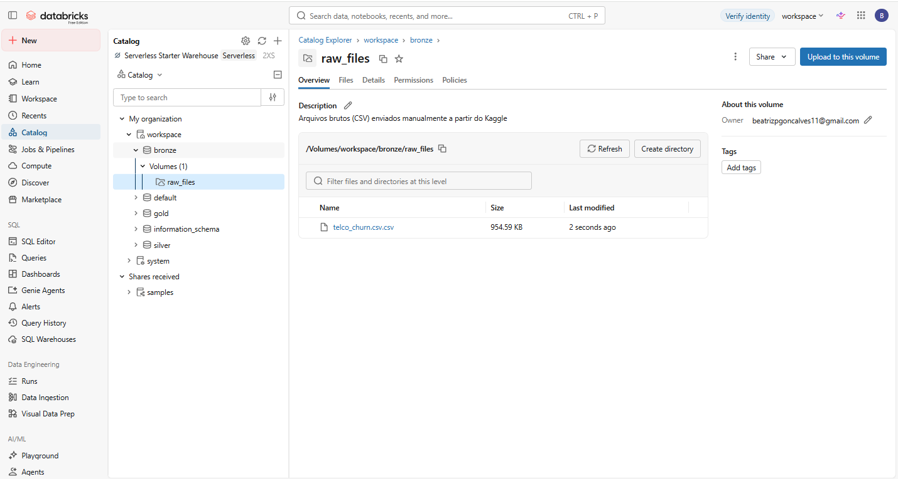

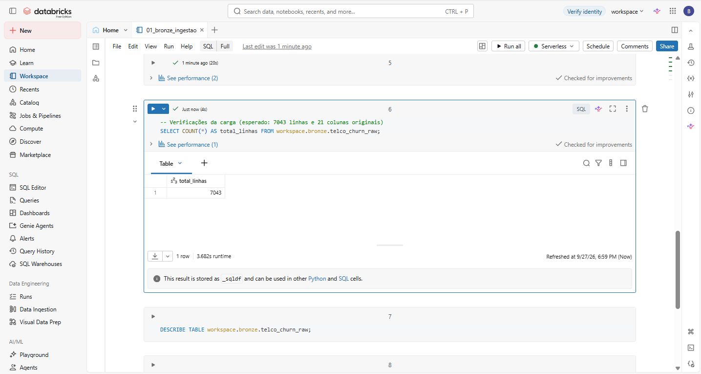

---

## 3. Modelagem e Catálogo de Dados (Etapa 4.3)

### 3.1 Modelo

Foi adotado um **Esquema Estrela** na camada Gold, pois o problema tem um fato central (a assinatura de cada cliente e seu status de churn) analisado sob diferentes perspectivas (perfil, contrato e serviços).

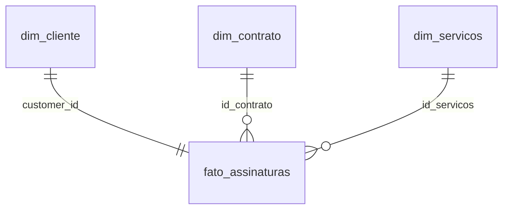
```mermaid
erDiagram
    dim_cliente ||--|| fato_assinaturas : "customer_id"
    dim_contrato ||--o{ fato_assinaturas : "id_contrato"
    dim_servicos ||--o{ fato_assinaturas : "id_servicos"
```

- **Granularidade da fato:** 1 linha por cliente (fotografia da assinatura no momento da extração).
- **Chaves substitutas:** `id_contrato` e `id_servicos` são geradas por `xxhash64` sobre a combinação de atributos. A mesma combinação sempre gera a mesma chave, o que agrupa clientes com as mesmas condições comerciais ou o mesmo pacote de serviços.
- **Por que estrela e não uma tabela única?** A base original é "flat" (uma tabela com tudo). Separar as dimensões organiza os atributos por assunto e deixa as consultas analíticas mais claras, que é o padrão de modelagem para consumo em Data Warehouses e ferramentas de BI.

### 3.2 Catálogo de Dados

Linhagem de todas as tabelas Gold: `bronze.telco_churn_raw` → `silver.clientes_telco` → `gold.*`.

**`gold.fato_assinaturas`**: métricas de assinatura e status de churn (1 linha por cliente, 7.043 linhas).

| Campo | Tipo | Descrição | Domínio | Origem |
|---|---|---|---|---|
| customer_id | string | FK → dim_cliente | 7.043 valores únicos | customerID |
| id_contrato | bigint | FK → dim_contrato | hash | derivado |
| id_servicos | bigint | FK → dim_servicos | hash | derivado |
| meses_cliente | int | Meses como cliente | 0 – 72 | tenure |
| faixa_permanencia | string | Faixa de permanência | 0-12, 13-24, 25-48, 49-72 meses | derivado de tenure |
| cobranca_mensal | decimal(10,2) | Valor mensal cobrado (US$) | 18,25 – 118,75 | MonthlyCharges |
| cobranca_total | decimal(10,2) | Total cobrado desde a contratação (US$) | 0,00 – 8.684,80 | TotalCharges (vazios → 0) |
| churn | boolean | Cliente cancelou? | TRUE / FALSE | Churn |

**`gold.dim_cliente`**: perfil demográfico (7.043 linhas, 1 por cliente).

| Campo | Tipo | Descrição | Domínio | Origem |
|---|---|---|---|---|
| customer_id | string | PK | único por cliente | customerID |
| genero | string | Gênero | Masculino, Feminino | gender |
| idoso | boolean | 65 anos ou mais | TRUE / FALSE | SeniorCitizen (0/1) |
| possui_parceiro | boolean | Tem cônjuge/parceiro(a) | TRUE / FALSE | Partner |
| possui_dependentes | boolean | Tem dependentes | TRUE / FALSE | Dependents |

**`gold.dim_contrato`**: condições comerciais (24 combinações distintas).

| Campo | Tipo | Descrição | Domínio | Origem |
|---|---|---|---|---|
| id_contrato | bigint | PK substituta | hash | derivado |
| tipo_contrato | string | Duração do contrato | Mensal, Anual, Bienal | Contract |
| fatura_digital | boolean | Fatura sem papel | TRUE / FALSE | PaperlessBilling |
| metodo_pagamento | string | Forma de pagamento | Cheque eletrônico, Cheque postal, Transferência bancária (automática), Cartão de crédito (automático) | PaymentMethod |

**`gold.dim_servicos`**: pacote de serviços contratados (322 combinações distintas).

| Campo | Tipo | Descrição | Domínio | Origem |
|---|---|---|---|---|
| id_servicos | bigint | PK substituta | hash | derivado |
| servico_telefone | boolean | Tem linha telefônica | TRUE / FALSE | PhoneService |
| multiplas_linhas | string | Múltiplas linhas | Sim, Não, Sem telefone | MultipleLines |
| servico_internet | string | Tipo de internet | DSL, Fibra óptica, Sem internet | InternetService |
| seguranca_online, backup_online, protecao_dispositivo, suporte_tecnico, streaming_tv, streaming_filmes | string | Serviços adicionais | Sim, Não, Sem internet | OnlineSecurity, OnlineBackup, DeviceProtection, TechSupport, StreamingTV, StreamingMovies |

**`silver.clientes_telco`**: contém todos os campos acima numa única tabela limpa, mais:

| Campo | Tipo | Descrição | Domínio |
|---|---|---|---|
| cobranca_total_imputada | boolean | TRUE quando TotalCharges veio vazio e foi substituído por 0 | TRUE (11 registros) / FALSE |
| _data_processamento | timestamp | Data/hora de processamento da camada Silver | — |

**`bronze.telco_churn_raw`**: as 21 colunas originais do CSV, sem alterações, mais `_data_ingestao` (timestamp da carga) e `_fonte` (origem do dado).

Todas as descrições foram registradas como comentários de tabela e coluna no **Unity Catalog**:

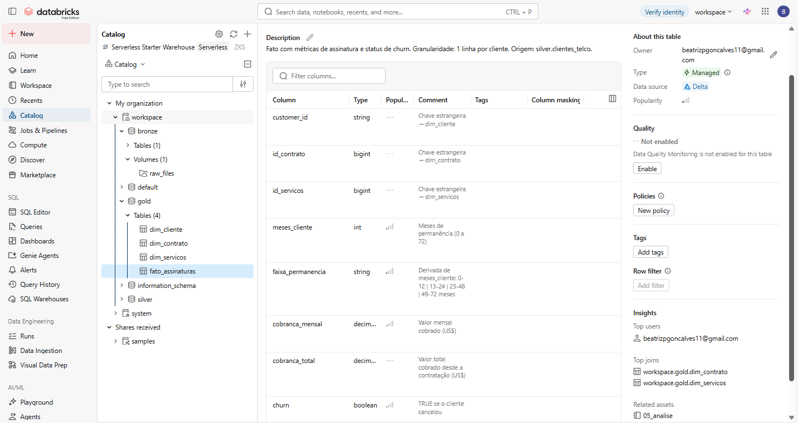

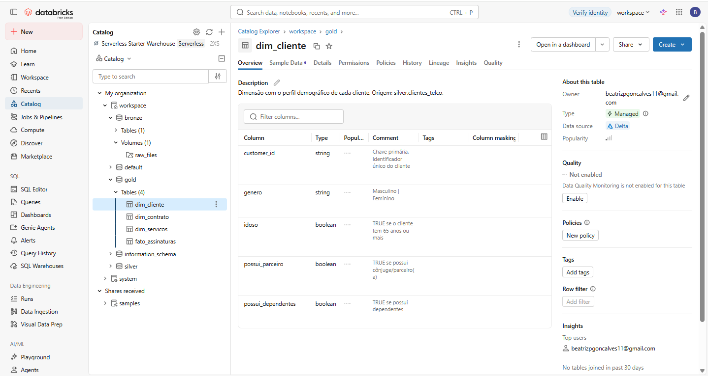

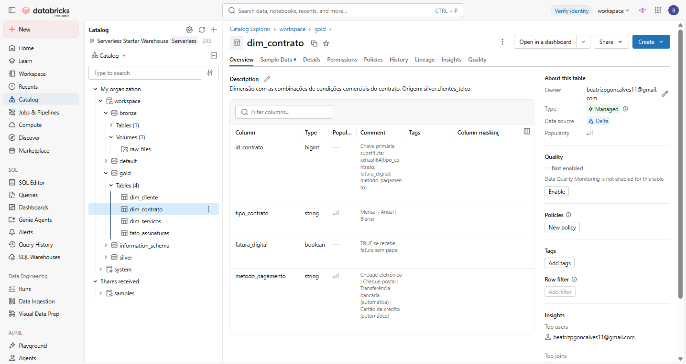

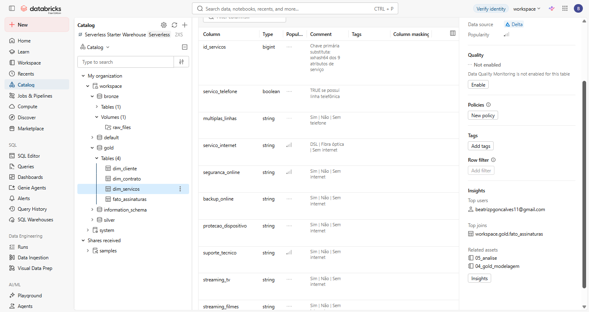

**Linhagem dos dados (Unity Catalog):**

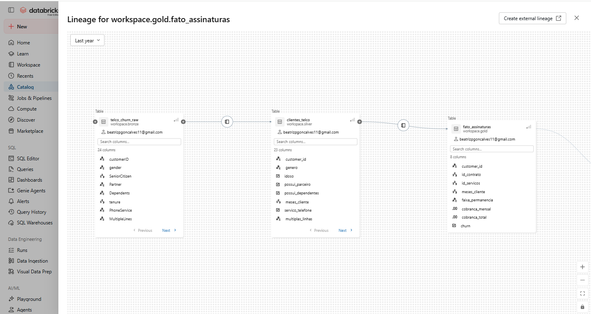

---

## 4. Pipeline de Dados (Etapa 4.4)

O pipeline foi dividido em **um notebook por etapa**, facilitando a manutenção e a reexecução:

| Notebook | Camada | O que faz |
|---|---|---|
| [`01_bronze_ingestao.sql`](notebooks/01_bronze_ingestao.sql) | Bronze | Cria schemas e volume, e carrega o CSV sem alterações |
| [`02_qualidade_dados.sql`](notebooks/02_qualidade_dados.sql) | Bronze | Diagnóstico de qualidade atributo por atributo |
| [`03_silver_limpeza.sql`](notebooks/03_silver_limpeza.sql) | Silver | Limpeza, tipagem, tradução, imputação e documentação |
| [`04_gold_modelagem.sql`](notebooks/04_gold_modelagem.sql) | Gold | Modelo estrela, catálogo e validação de integridade |
| [`05_analise.sql`](notebooks/05_analise.sql) | Gold | Consultas que respondem às perguntas de negócio |

**Principais transformações (Silver):**

| # | Transformação | Motivo |
|---|---|---|
| 1 | Colunas renomeadas para português, em `snake_case` | Clareza para o time de negócio e padronização |
| 2 | `TotalCharges`: texto → `DECIMAL(10,2)` | A coluna foi lida como texto por conter valores em branco |
| 3 | `TotalCharges` vazio → 0, com a flag `cobranca_total_imputada` | Os 11 casos são clientes com 0 meses, ainda não faturados |
| 4 | Campos Yes/No e `SeniorCitizen` (0/1) → `BOOLEAN` | Tipagem correta e padronização entre colunas |
| 5 | Categorias traduzidas via função SQL reutilizável `silver.fn_traduz_resposta` | Padronização do domínio em português |
| 6 | `TRIM` e `DISTINCT` | Remover espaços e prevenir duplicatas em cargas futuras |

**Validações do pipeline:**
- **Silver:** 7.043 linhas e 7.043 clientes distintos; 0 nulos em `cobranca_total`; 11 registros imputados; 0 categorias não mapeadas.
- **Gold:** fato e `dim_cliente` com 7.043 linhas cada, `dim_contrato` com 24 linhas e `dim_servicos` com 322 linhas; 0 registros órfãos entre a fato e as dimensões de contrato e serviços.

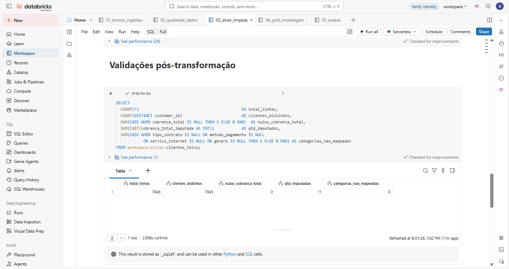

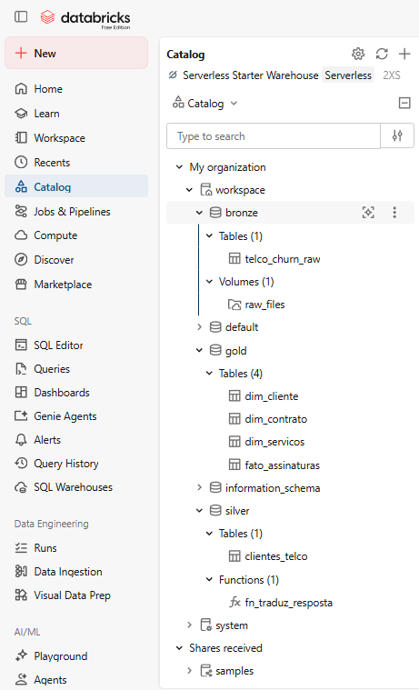

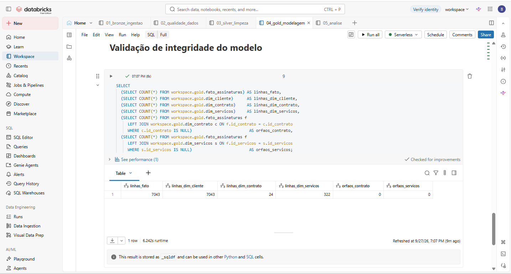

---

## 5. Qualidade de Dados (Etapa 4.5)

O diagnóstico foi feito na camada Bronze (dado original), atributo por atributo, e orientou as transformações da Silver. Script: [`notebooks/02_qualidade_dados.sql`](notebooks/02_qualidade_dados.sql).

| Dimensão | Verificação | Resultado | Tratamento |
|---|---|---|---|
| Completude | Nulos/vazios nas 21 colunas | 11 vazios em TotalCharges (0,16%); demais colunas completas | Vazios → 0 + flag `cobranca_total_imputada`, pois todos têm `tenure = 0` (clientes novos, ainda não faturados) |
| Unicidade | Duplicatas de customerID | 0 duplicatas (7.043 linhas = 7.043 clientes) | `DISTINCT` preventivo na Silver |
| Consistência | Domínio das 17 colunas categóricas | Todas com 2 a 4 valores esperados, sem variações de escrita. SeniorCitizen em 0/1, diferente das demais (Yes/No) | Padronização para booleano, tradução para português e manutenção de "Sem internet"/"Sem telefone" como categorias válidas |
| Acurácia | Faixas numéricas | tenure 0–72; mensal US$ 18,25–118,75; total US$ 18,80–8.684,80 | Nenhum necessário |
| Outliers | Método IQR | 0 outliers em tenure, MonthlyCharges e TotalCharges | Nenhum necessário |
| Tipagem | Tipos inferidos na leitura | TotalCharges lido como texto | Conversão para decimal |

**Detalhe sobre os 11 registros vazios:** 10 deles têm contrato bienal e 1 tem contrato anual. São contratos já assinados, mas cuja primeira cobrança ainda não aconteceu. Por isso, remover essas linhas foi descartado: elas representam clientes válidos. Após a transformação, confirmou-se na Silver que os 11 registros imputados têm `meses_cliente = 0`.

**Sobre "No internet service" e "No phone service":** não são erros, e sim a indicação de que o cliente não possui o serviço base. Foram mantidas como categorias próprias.

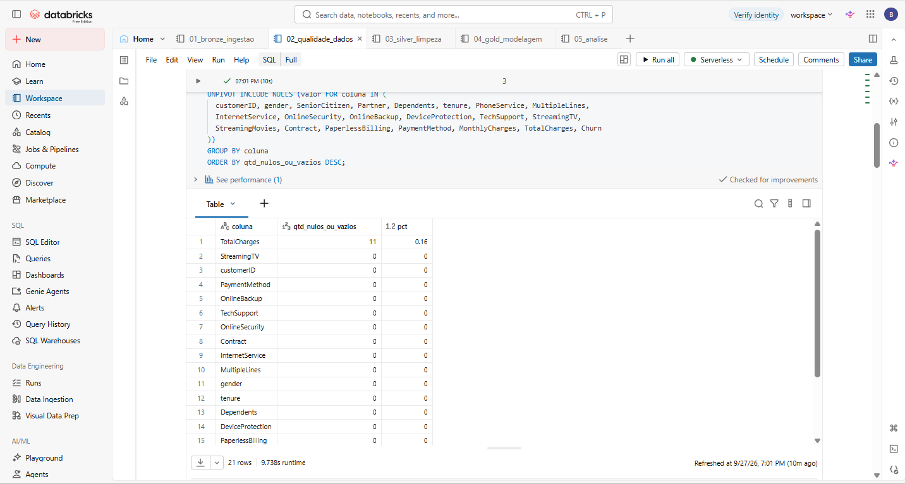

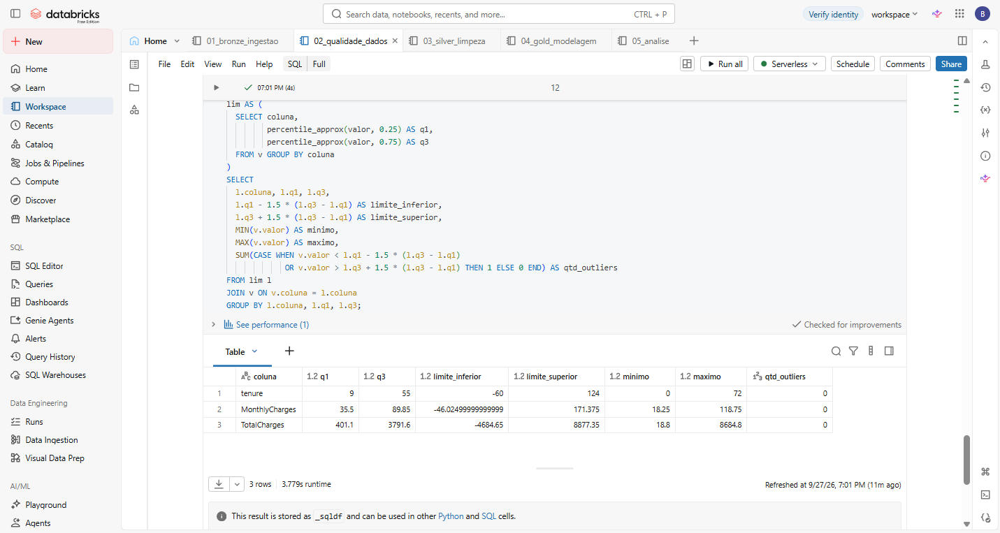

---

## 6. Análise de Dados (Etapa 4.5)

Todas as consultas usam o modelo estrela da camada Gold. Script: [`notebooks/05_analise.sql`](notebooks/05_analise.sql).

### P1. Qual a taxa de churn geral e como ela varia por tipo de contrato?

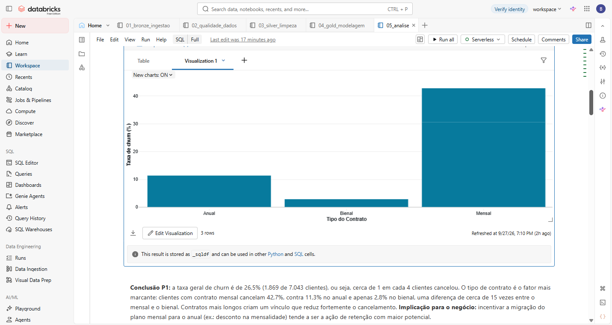

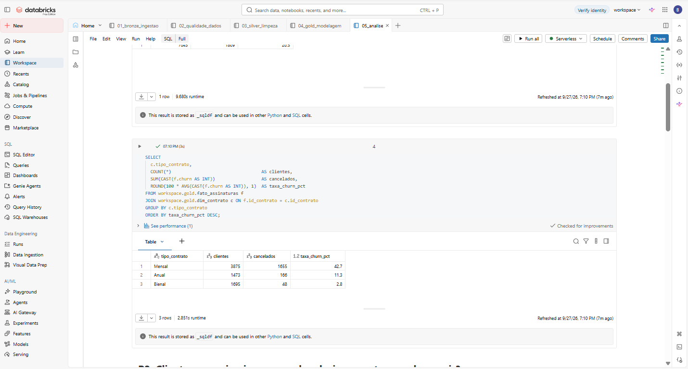

A taxa geral de churn é de **26,5%** (1.869 de 7.043 clientes), ou seja, cerca de 1 em cada 4 clientes cancelou. O tipo de contrato é o fator mais marcante: clientes com contrato mensal cancelam **42,7%**, contra **11,3%** no anual e apenas **2,8%** no bienal, uma diferença de cerca de 15 vezes entre o mensal e o bienal. Contratos mais longos criam um vínculo que reduz fortemente o cancelamento.

**Implicação para o negócio:** incentivar a migração do plano mensal para o anual (ex.: desconto na mensalidade) tende a ser a ação de retenção com maior potencial.

### P2. Clientes nos primeiros meses de relacionamento cancelam mais?

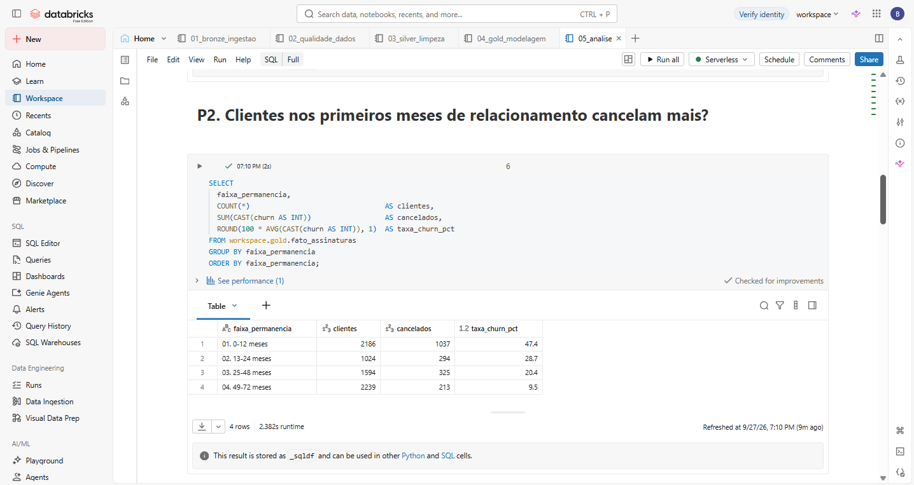

Sim, o risco é muito maior no início do relacionamento. Clientes com até 12 meses de casa cancelam **47,4%**, e a taxa cai progressivamente (28,7% entre 13 e 24 meses; 20,4% entre 25 e 48 meses) até **9,5%** entre os clientes com mais de 4 anos. O primeiro ano funciona como um "período crítico": quem passa dele tende a permanecer.

**Implicação para o negócio:** concentrar esforços de retenção nos primeiros meses, com acompanhamento no onboarding e contato proativo antes do fim do primeiro ano.

### P3. O método de pagamento está associado ao churn?

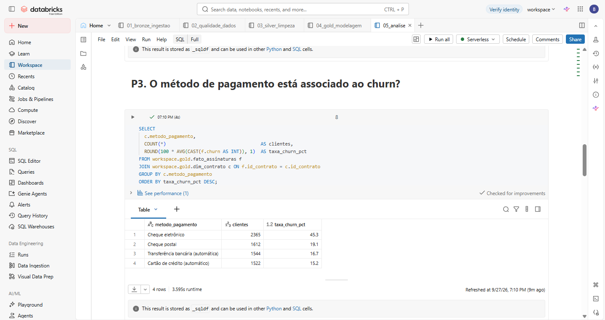

Sim. Clientes que pagam com cheque eletrônico cancelam **45,3%**, cerca de 3 vezes mais que os que usam pagamento automático (transferência bancária: **16,7%**; cartão de crédito: **15,2%**). O cheque postal fica em uma posição intermediária (19,1%). No pagamento automático, o cliente não precisa "decidir pagar" todo mês, o que reduz os momentos em que ele reconsidera o serviço.

**Implicação para o negócio:** oferecer benefício para quem aderir ao débito automático. Importante: a análise mostra associação, não causa. O método de pagamento pode estar refletindo outro perfil de cliente (ex.: clientes com contrato mensal).

### P4. Clientes que contratam suporte técnico e segurança online cancelam menos?

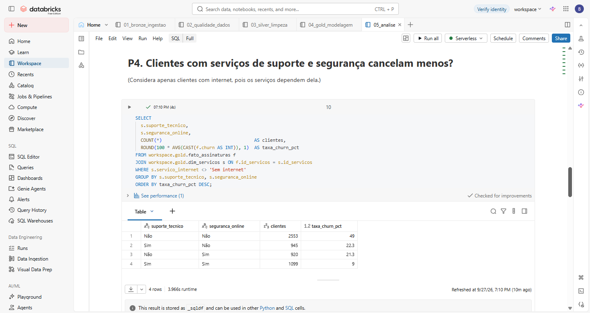

Sim. Entre os clientes com internet, quem não contrata nenhum dos dois serviços apresenta a maior taxa de churn (**49,0%**), enquanto quem contrata suporte técnico e segurança online cancela apenas **9,0%**, uma taxa mais de 5 vezes menor. Contratar apenas um dos serviços já reduz o churn para cerca de 22% (22,3% só com suporte; 21,3% só com segurança). Serviços adicionais aumentam o valor percebido e a dependência do cliente em relação à operadora.

**Implicação para o negócio:** oferecer suporte técnico e segurança online como bônus temporário para clientes novos ou em risco, como ferramenta de retenção.

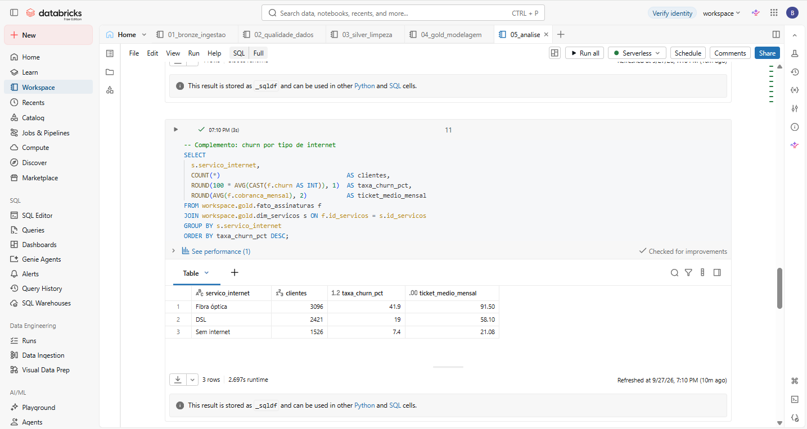

**Complemento:** clientes de fibra óptica cancelam **41,9%**, mais que o dobro dos clientes DSL (**19,0%**), apesar de ser o serviço mais moderno. O ticket médio da fibra é o mais alto (US$ 91,50, contra US$ 58,10 do DSL). Uma hipótese é que o preço ou a qualidade percebida não estejam compatíveis com a expectativa do cliente. Os dados não permitem confirmar a causa, mas esse é um ponto que merece investigação.

### P5. Quanto de receita mensal é perdida com o churn e em qual segmento ela se concentra?

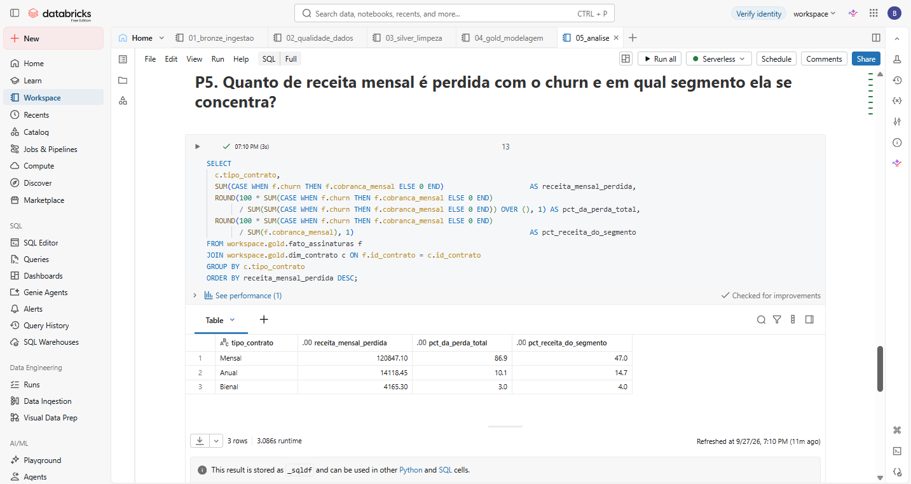

O churn representa uma perda de **US$ 139.130,85** em receita mensal. Desse total, **86,9%** vem dos contratos mensais, que perdem **47,0%** da própria receita do segmento. Os contratos anual e bienal, juntos, respondem por apenas **13,1%** da perda.

**Implicação para o negócio:** o problema de receita está concentrado em um único segmento, o que torna a ação de retenção mais focada e com retorno mais previsível.

### Discussão geral

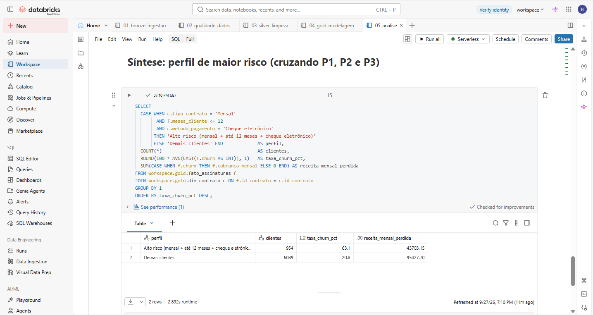

As cinco respostas apontam para a mesma direção: o churn não está espalhado de forma uniforme pela base, e sim concentrado em um perfil bem definido. Contrato mensal (P1), pouco tempo de casa (P2) e pagamento por cheque eletrônico (P3) são os três fatores mais associados ao cancelamento.

Cruzando esses três fatores, identificamos um grupo de **954 clientes** com churn de **63,1%**, cerca de 3 vezes a taxa dos demais (**20,8%**). Esse grupo representa apenas **13,5% da base**, mas é responsável por **US$ 43.703,15** da receita mensal perdida, ou seja, **31,4% de toda a perda** (P5).

A P4 mostra ainda que serviços adicionais funcionam como fator de proteção: quem tem suporte técnico e segurança online cancela 5 vezes menos. O alto churn da fibra óptica, o serviço mais caro, sugere um possível desalinhamento entre preço e valor percebido.

**Recomendações de negócio:**
1. Priorizar o perfil de alto risco nas ações de retenção.
2. Incentivar a migração de contratos mensais para anuais.
3. Estimular a adesão ao pagamento automático.
4. Oferecer suporte técnico e segurança online como bônus de retenção.
5. Criar um programa de acompanhamento nos primeiros 12 meses.
6. Investigar a satisfação dos clientes de fibra óptica.

---

## 7. Autoavaliação

**Objetivos atingidos:** as cinco perguntas de negócio definidas no início foram respondidas integralmente. O pipeline foi construído de ponta a ponta na nuvem, seguindo a arquitetura medalhão: ingestão do dado bruto (Bronze), diagnóstico de qualidade, limpeza e padronização (Silver) e modelagem em esquema estrela (Gold), com catálogo documentado no Unity Catalog e linhagem rastreável entre as camadas. Além das perguntas originais, a análise cruzada permitiu identificar um perfil de alto risco que não estava previsto no planejamento.

**Dificuldades encontradas:**
- Esta foi minha primeira experiência com Databricks e Unity Catalog. Entender a organização em catálogo, schemas, volumes e tabelas exigiu um período de adaptação.
- Erro na primeira carga (`CF_PATH_DOES_NOT_EXIST_FOR_READ_FILES`): o arquivo tinha sido salvo como `telco_churn.csv.csv` por causa da extensão oculta no Windows. O problema foi identificado com o comando `LIST` no volume e corrigido ajustando o caminho no script de ingestão.
- Decidir como tratar os valores vazios de TotalCharges. A investigação mostrou que eram clientes recém-contratados, o que levou à imputação com 0 em vez da exclusão das linhas.
- Transformar uma base única ("flat") em um modelo estrela, definindo quais atributos pertencem a cada dimensão e como gerar as chaves substitutas.
- Configurar corretamente as visualizações no Databricks (eixos com categoria vs. medida) e as células de texto (`%md`) nos notebooks.

**Limitações:**
- A base é uma fotografia única, sem histórico temporal. Isso impede analisar a evolução do churn mês a mês e criar uma dimensão de tempo.
- A base é pequena (7 mil linhas) e de exemplo, o que não exige a escala do Spark, mas permitiu exercitar o fluxo completo.
- As análises mostram associação, não causalidade.
- A carga foi feita por upload manual, e não por um processo automatizado.

**Trabalhos futuros:**
- Orquestrar o pipeline com **Databricks Jobs/Workflows** para cargas automáticas e agendadas.
- Incorporar dados temporais (histórico de faturas e atendimentos) para uma dimensão de tempo.
- Consumir a camada Gold em um **dashboard** (Databricks AI/BI ou Power BI).
- Integrar com o modelo de previsão de churn desenvolvido no MVP de Machine Learning ([mvp-churn-telco](https://github.com/beatrizpgoncalves11-git/mvp-churn-telco)), usando a camada Gold como fonte de dados do modelo.
